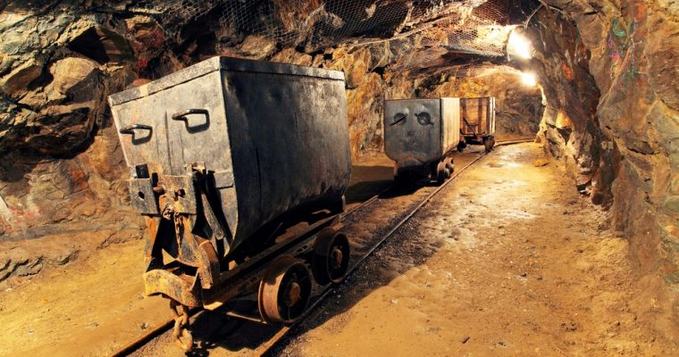
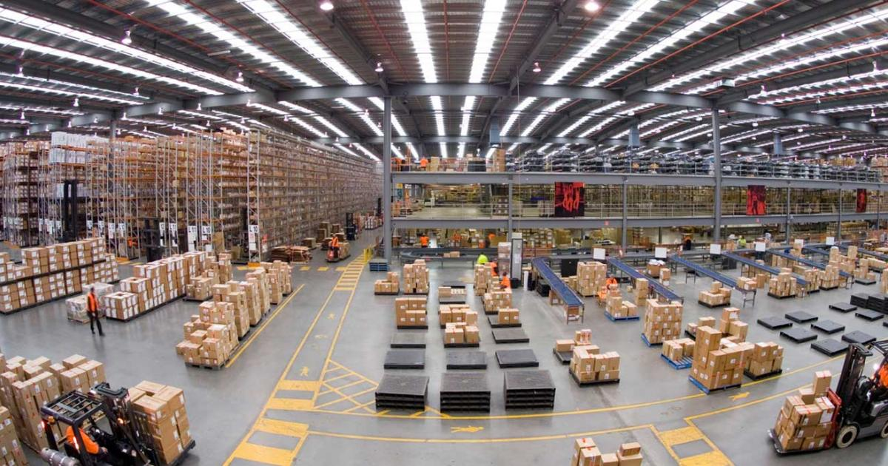
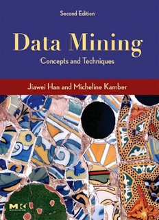
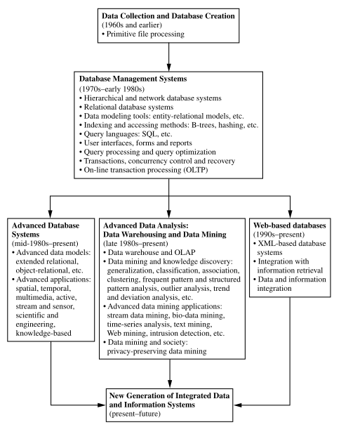
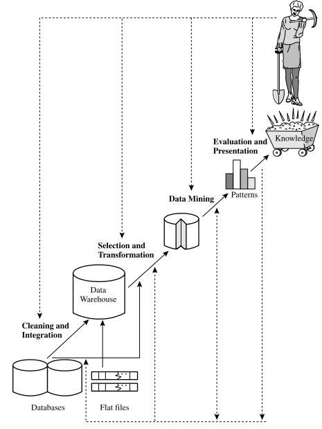
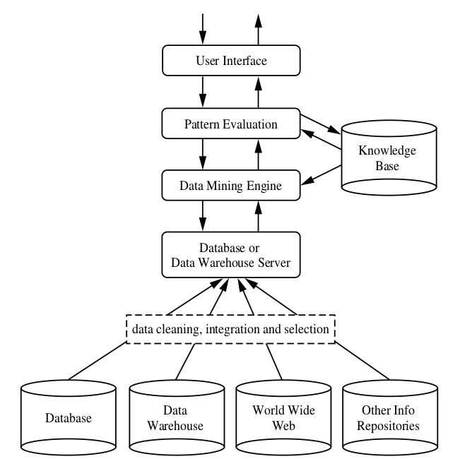
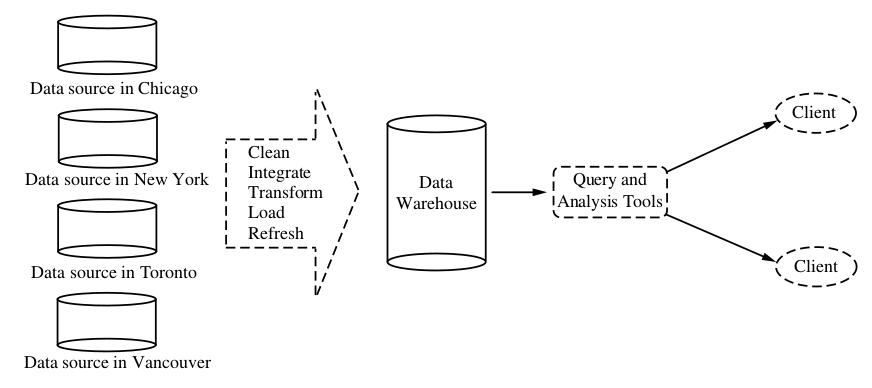

Data Mining and Data Warehousing
========================================================
author: Imran Ali 
date: 11th March, 2018 
autosize: true

========================================================

========================================================

Course Outline
========================================================

- Concepts of Data Mining
- Data Preprocessing
- Data Warehouse and OLAP Technology
- Mining Frequent Patters
- Classification and Prediction
- Application and Trends in Data Mining

Reference Material
========================================================

- Book Title: Data Mining Concepts and Techniques
- Authors: Jiawei Han and Micheline Kamber

Grading
========================================================

- Mid Term 40%
- Final Term 40%
- Assignments + Quizes 20%

What Motivated Data Mining?
========================================================

We are data rich, but information poor
========================================================

We are data rich, but information poor
========================================================

What is Data Mining?
========================================================
- Extracting knowledge from large amounts of data
- Many treat data mining as synonym of Knowledge Discovery from Data (KDD)
- Others view it as one of steps in the process of KDD

Data Mining as one of the steps in KDD
========================================================

Architecture of a typical data mining system
========================================================

Data Mining on what kind of data
=======================================================
- Relational Databases (DBMS)
- Data Warehouses

Data Mining on what kind of data (contd)
=======================================================
- Transactional Databases
- Object-Relational Databases
- Temporal Databases, Sequence Databases, and Time-Series Databases
- Spatial Databases
- Text Databases and Multimedia Databases
- Data Streams
- World Wide Web

Transactional Databases
=======================================================
- consists of a file where each record represents

Data Mining Functionalities and kinds of patterns
=======================================================
- Data mining tasks can be classified into two categories:
  1. Descriptive: characterize general properties of data in the database
  2. Predictive: perform inference on the current data to make predictions
  
