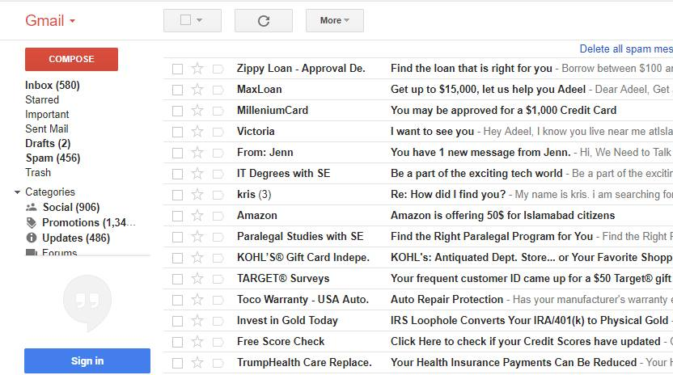
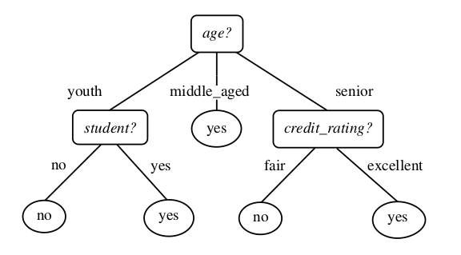

```{r setup, include=FALSE}
knitr::opts_chunk$set(echo = TRUE)
```

## Are we already using a classifier?



## What is spam?

**Spam:** _irrelevant messages_ sent over the internet,  typically to a _large number of users_
for the _purpose of_   

- advertising
- phishing 
- spreading malware

**phishing:** The fraudulent practice of sending emails purporting to be from reputable companies in order to induce individuals to reveal personal information, such as passwords and credit card numbers.

**malware:** software which is specifically designed to disrupt, damage, or gain authorized access to a computer system.

## How can spam be identified?
Inspecting various attributes of an email e.g.

1. Number of recipient 
2. Unknown sender
3. Keywords or phrases in subject or body of the email
4. size of the content

## Some questions to ponder

1. Are all attributes equally important?
2. How to decide which attribute is more important?

## Classification using Decision Trees
### What is a decision tree?

It is a (flowchart like) **_tree structure_**


- Decision Tree indicating whether a customer is likely to purchase a computer
- Each **internal node** represents a **test** on an attribute  
- Each **leaf node** represents a **class** (either yes or no)  